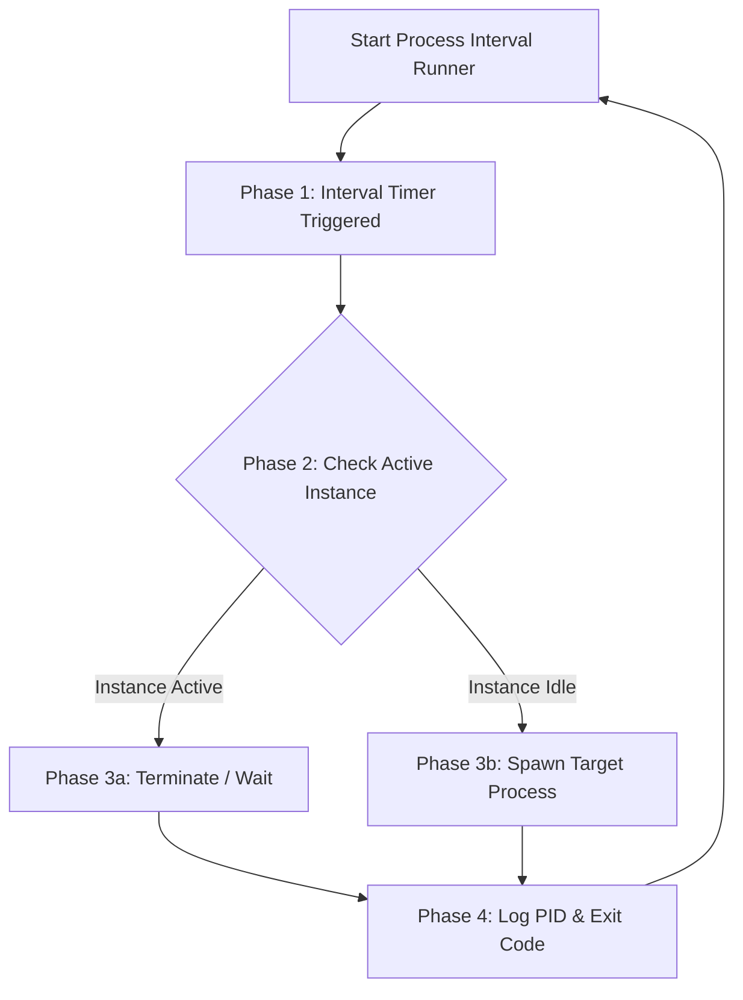

# ⚡ Process Interval Runner

**A Lightweight, High-Precision Background Interval Execution Engine for Windows Systems**

 

`#windows-automation` `#process-management` `#devops` `#system-administration` `#background-runner` `#process-interval-runner`

---

## 📌 Overview

**Process Interval Runner** is an enterprise-grade utility designed for reliable, automated execution of applications and scripts at specified time intervals. Built specifically for system administrators, DevOps, and power users, it ensures continuous process lifecycle management, prevents overlapping executions, and provides detailed runtime tracking with minimal resource footprint.

---

## 🌟 Key Features

| Feature | Description |
| :--- | :--- |
| **⏱️ Micro-Precision Scheduling** | Sub-second accuracy across customizable loop timers. |
| **🛡️ Anti-Collision Isolation** | Detects active target instances before execution to prevent memory corruption or duplicate tasks. |
| **⚡ Ultra-Low Overhead** | Optimized background thread management utilizing negligible CPU and RAM resources. |
| **📊 Audit & Runtime Logging** | Real-time PID tracking, exit code verification, and timestamped log generation. |
| **🛠️ Scripting Engine Support** | Out-of-the-box compatibility with `.exe`, `.bat`, `.cmd`, `.ps1`, and custom CLI binaries. |

---

## 🔄 Execution Flow

---

## ⚙️ Configuration Parameters

| Parameter | Type | Required | Description |
| :--- | :---: | :---: | :--- |
| `Target` | `String` | Yes | Path to executable file (`.exe`, `.bat`, `.ps1`) |
| `Interval` | `Integer` | Yes | Frequency interval in seconds |
| `Arguments` | `String` | No | Additional runtime CLI flags |
| `Overlaps` | `Boolean` | No | Allow or restrict concurrent process execution |

---

## 👤 Developer Profile

| **Lead Developer** | **GitHub Profile** | **Project Repository** |
| :---: | :---: | :---: |
| **Majid** | [@epicmajid](https://github.com/epicmajid) | [process-interval-runner](https://github.com/epicmajid) |

---

## 🏷️ Topic Tags & Keywords

`#ProcessRunner` `#WindowsAutomation` `#DevOpsTools` `#BackgroundService` `#TaskScheduler` `#MajidProjects`

---

## 📜 License

Distributed under the **MIT License**. See [`LICENSE`](LICENSE) for more information.

  Created by <a href="https://github.com/epicmajid">@epicmajid</a>

